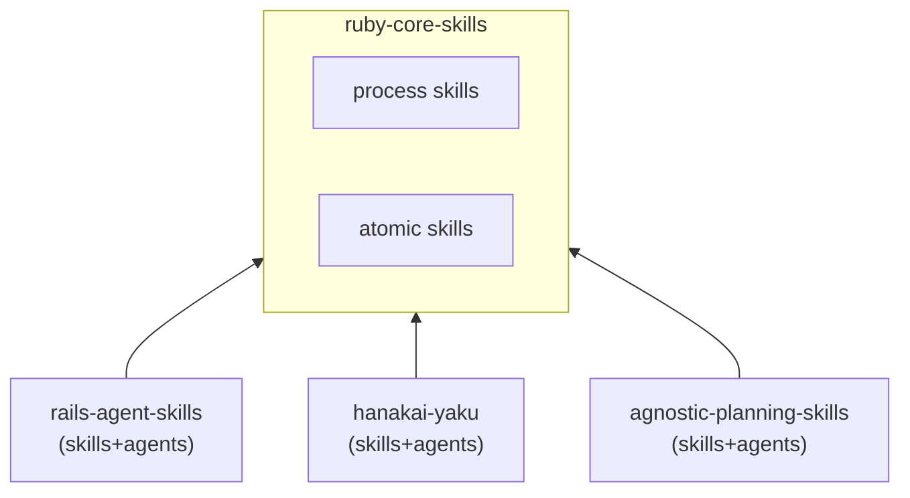

# AI Skill Ecosystem — Ruby Core Skills


Shared Ruby development skills and process-discipline knowledge for the AI skill ecosystem. This repository contains framework-agnostic foundations for TDD, refactoring, code review, security review, DDD, inline documentation, and common Ruby design patterns.

## Part of the AI Skill Ecosystem

This repo is one of 6 in a composable AI skill ecosystem:

| Repo | Role |
|------|------|
| [**`ruby-core-skills`**](https://github.com/igmarin/ruby-core-skills) | 15 shared Ruby skills + process discipline |
| [`rails-agent-skills`](https://github.com/igmarin/rails-agent-skills) | 28 Rails-specific skills + 9 agents |
| [`hanakai-yaku`](https://github.com/igmarin/hanakai-yaku) | 35 Hanami/dry-rb skills + 10 agents |
| [`agnostic-planning-skills`](https://github.com/igmarin/agnostic-planning-skills) | 10 planning skills + 4 agents |
| [`agent-mcp-runtime`](https://github.com/igmarin/agent-mcp-runtime) | Rust CLI runtime (pack resolution, MCP) |
| [`ruby-skill-bench`](https://github.com/igmarin/ruby-skill-bench) | Benchmark/eval engine |

See the [Ecosystem Overview](https://github.com/igmarin/agent-mcp-runtime/blob/main/docs/ecosystem.md) for the full architecture.

### Dependency Direction



Framework repos depend on core skills. `ruby-core-skills` does not know about any downstream frameworks.


> Supported agent environments
>
> [](#)
> [](#)
> [](#)
> [](#)
> [](#)
> [](#)
> [](#)
>
> [](https://github.com/igmarin/agnostic-planning-skills/pulls)
> [](LICENSE)
> [](https://skills.sh/igmarin/ruby-core-skills)
> 
> [](https://tessl.io/registry/igmarin/ruby-core-skills)

---

## Skill Inventory

| Skill | Category | Description |
|---|---|---|
| **define-domain-language** | DDD | Extracting ubiquitous language or glossary definitions. |
| **review-domain-boundaries** | DDD | Auditing context boundaries and language leakage. |
| **model-domain** | DDD | Tactical DDD design (aggregates, entities, value objects, domain services). |
| **write-yard-docs** | Documentation | Writing or reviewing inline YARD documentation for public Ruby APIs. |
| **create-service-object** | Patterns | Creating a service object (PORO `.call` pattern). |
| **implement-calculator-pattern** | Patterns | Implementing polymorphic variant-based calculators (Strategy + Factory). |
| **integrate-api-client** | Patterns | Designing HTTP integrations (layered client/fetcher/builder pattern). |
| **triage-bug** | Testing | Investigating a bug, reproducing via failing test, and creating a repair plan. |
| **respond-to-review** | Code Quality | Receiving code review feedback and addressing comments. |
| **skill-router** | Orchestration | Triaging and decomposing complex Ruby requests into ordered sub-tasks. |
| **generate-tdd-tasks** | Planning | Breaking features into TDD quadruplet task lists with docs and review tasks. |
| **tdd-process** | Process | General engineering loop: Red-Green-Refactor process gates and checkpoints. |
| **refactor-process** | Process | Safely refactoring code while preserving behavior under characterization tests. |
| **review-process** | Process | Reviewing changesets (severity taxonomies, structured findings, re-review). |
| **security-review-process** | Process | Reviewing code for general Ruby security flaws (secrets, injections). |
| **test-planning-process** | Process | Choosing test boundaries (unit vs integration) and test scenarios. |

---

## Installation & Usage

Install skills via skills.sh:

```bash
npx skills add igmarin/ruby-core-skills
```

Or via GitHub CLI (v2.90.0+):

```bash
# Install all skills interactively
gh skill install igmarin/ruby-core-skills

# Install a specific skill
gh skill install igmarin/ruby-core-skills tdd-process --scope project
```

Core skills are also consumed by AI agents via the `agent-mcp-runtime` CLI tool:

```bash
# Resolves framework skills first, falls back to core skills
agent-mcp-runtime --pack rails --task "Add full_name to User model"
```

---

## License

This project is licensed under the MIT License. See [LICENSE](LICENSE) for details.
