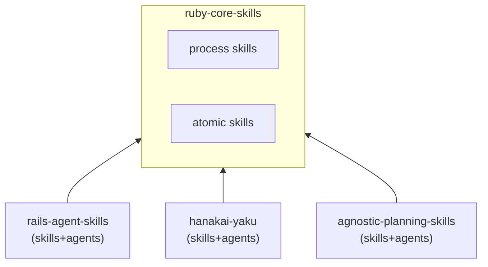

# AI Skill Ecosystem — Ruby Core Skills

Shared Ruby development skills and process-discipline knowledge for the AI skill ecosystem. This repository contains framework-agnostic foundations for TDD, refactoring, code review, security review, DDD, inline documentation, and common Ruby design patterns.

## Part of the AI Skill Ecosystem

This repository is a core component of the multi-repo AI Skill Ecosystem:

1. **`ruby-core-skills` (This repository)**: Contains 16 foundational Ruby programming, planning, and software engineering process-discipline skills. **Contains zero agents.**
2. **`rails-agent-skills`**: Curated library of Rails-specific skills + 9 specialized agents that compose core processes.
3. **`hanakai-yaku`**: Curated library of Hanami-specific skills + 10 specialized agents.
4. **`agnostic-planning-skills`**: Generic project management, planning, and task breakdown skills + 4 agents.
5. **`agent-mcp-runtime`**: The Rust-based CLI runtime that acts as the composition and resolution engine.

### Dependency Direction



Framework repos depend on core skills. `ruby-core-skills` does not know about any downstream frameworks.

[](https://tessl.io/registry/igmarin/ruby-core-skills)

---

## Skill Inventory

| Skill | Category | Description |
|---|---|---|
| **define-domain-language** | DDD | Extracting ubiquitous language or glossary definitions. |
| **review-domain-boundaries** | DDD | Auditing context boundaries and language leakage. |
| **model-domain** | DDD | Tactical DDD design (aggregates, entities, value objects, domain services). |
| **write-yard-docs** | Documentation | Writing or reviewing inline YARD documentation for public Ruby APIs. |
| **create-service-object** | Patterns | Creating a service object (PORO `.call` pattern). |
| **implement-calculator-pattern** | Patterns | Implementing polymorphic variant-based calculators (Strategy + Factory). |
| **integrate-api-client** | Patterns | Designing HTTP integrations (layered client/fetcher/builder pattern). |
| **triage-bug** | Testing | Investigating a bug, reproducing via failing test, and creating a repair plan. |
| **respond-to-review** | Code Quality | Receiving code review feedback and addressing comments. |
| **skill-router** | Orchestration | Triaging and decomposing complex Ruby requests into ordered sub-tasks. |
| **generate-tdd-tasks** | Planning | Breaking features into TDD quadruplet task lists with docs and review tasks. |
| **tdd-process** | Process | General engineering loop: Red-Green-Refactor process gates and checkpoints. |
| **refactor-process** | Process | Safely refactoring code while preserving behavior under characterization tests. |
| **review-process** | Process | Reviewing changesets (severity taxonomies, structured findings, re-review). |
| **security-review-process** | Process | Reviewing code for general Ruby security flaws (secrets, injections). |
| **test-planning-process** | Process | Choosing test boundaries (unit vs integration) and test scenarios. |

---

## Installation & Usage

Core skills are consumed by AI agents via the `agent-mcp-runtime` CLI tool.

During development, you can point the runtime to this local directory using the `--registry` flag:

```bash
agent-mcp-runtime --registry ./path/to/ruby-core-skills --task "Review this code"
```

In production, the runtime uses the central `registry.json` manifest to resolve dependencies automatically. When running a framework pack, the runtime loads the framework's own skills first, falling back to core skills for any general Ruby concerns:

```bash
# Resolves Rails agents/skills first, then falls back to core skills
agent-mcp-runtime --pack rails --task "Add full_name to User model"
```

---

## License

This project is licensed under the MIT License. See [LICENSE](LICENSE) for details.