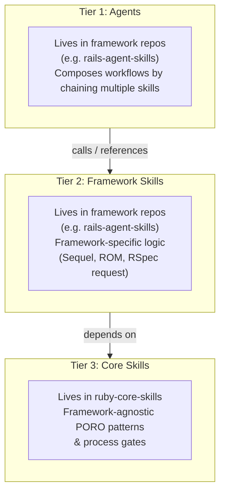

# AI Skill Ecosystem — Architecture Map

This document explains the design principles, repository structures, and resolution rules of the AI Skill Ecosystem.

---

## 1. Why `ruby-core-skills` Exists

AI agents are highly effective when equipped with structured workflows (skills). However, as the number of supported frameworks grows (Rails, Hanami, Sinatra, etc.), maintaining separate, duplicate versions of core engineering processes leads to:
1. **Instruction Drift:** Updates to the TDD process in the Rails repository do not propagate to Hanami.
2. **Naming Collisions:** Multiple repos containing `plan-tests` or `refactor-code` break flat-namespace resolvers.
3. **Bloat:** Framework-specific repos become too large to clone, cache, and analyze.

`ruby-core-skills` solves this by extracting all framework-agnostic Ruby design patterns (service objects, API client architectures, DDD glossary structures) and software engineering processes (TDD gates, refactoring, code review severity scales) into a single, dependency-free library.

---

## 2. The 3-Tier Dependency Model

The ecosystem follows a strict hierarchical dependency model:

- **Downstream repos (Tier 1 & 2) know about Tier 3.**
- **Tier 3 (Core) has zero knowledge of downstream frameworks.**

---

## 3. Process-Discipline Skills

Process-discipline skills are a special category of skill in `ruby-core-skills`:
- `tdd-process`
- `refactor-process`
- `review-process`
- `security-review-process`
- `test-planning-process`

Unlike atomic skills (which define concrete file skeletons and patterns), process-discipline skills define *how to think about* and *gate* a software engineering process. They declare non-negotiable gates (e.g., "NO implementation code until a failing test runs and fails").

---

## 4. How Framework Agents Consume Core Skills

Framework-specific agents chain core process-discipline skills with their own local skills to create unified workflows.

### Example: Rails `tdd` Agent Workflow

The Rails `tdd` agent (in `rails-agent-skills`) orchestrates a feature build by executing this chain:

1. **`load-context`** (Rails-specific): Discovers ActiveRecord schema and routes.
2. **`plan-tests`** (Rails-specific): Selects the RSpec request or model file.
3. **`tdd-process`** (Core): Enforces the Red-Green-Refactor gate.
4. **`write-tests`** (Rails-specific): Guides writing Rails RSpec matchers.
5. **`implement`** (Rails code logic).
6. **`refactor-process`** (Core): Enforces characterization baseline checks before editing.
7. **`write-yard-docs`** (Core): Enforces public API documentation.
8. **`code-review`** (Rails-specific): Verifies ActiveRecord queries, preloading, and safety.

By separating concerns, the core process-discipline skills ensure that the agent follows rigorous engineering loops, while the framework skills provide the exact syntax and configurations needed for the specific platform.
