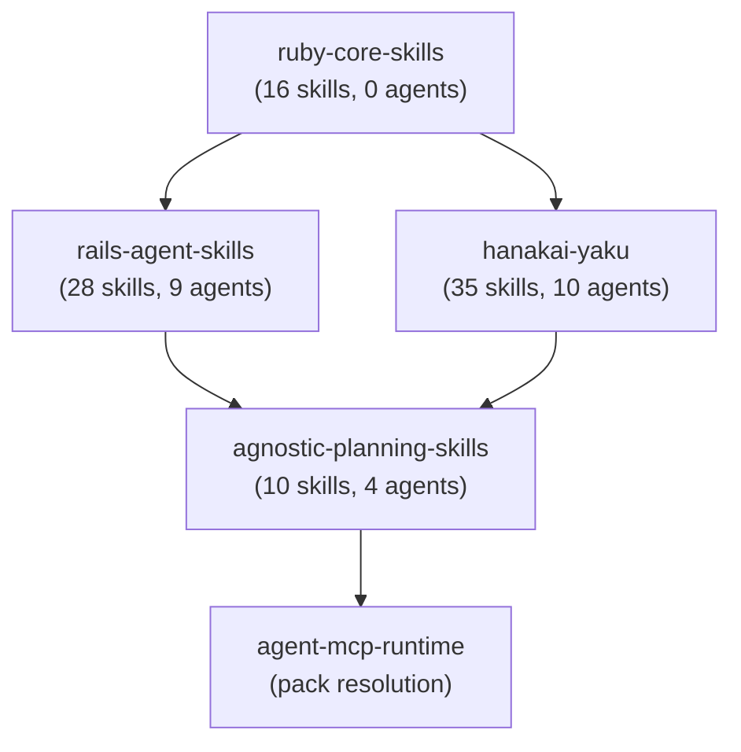

# Skill Classification Table

> **Status:** Final — Phase 0 Deliverable
> **Date:** 2026-05-24
> **Scope:** All 85 skills across `rails-agent-skills`, `hanakai-yaku`, and `agnostic-planning-skills`
> **Target:** Post-migration state with `ruby-core-skills` as the shared foundation

---

## Executive Summary

This document maps every skill in the ecosystem to its target repository after the Phase 1–2 migration. The goal is to eliminate naming collisions, clarify ownership, and establish a clean dependency graph where `ruby-core-skills` provides shared atomic, process-discipline, and planning skills, and framework repos depend on it.

**Pre-migration totals:**
- `rails-agent-skills`: 38 skills, 9 agents
- `hanakai-yaku`: 37 skills, 10 agents
- `agnostic-planning-skills`: 10 skills, 4 agents
- `ruby-core-skills`: 0 skills, 0 agents (empty)
- **Total: 85 skills, 23 agents**

**Post-migration totals:**
- `ruby-core-skills`: 16 skills, 0 agents
- `rails-agent-skills`: 28 skills, 9 agents
- `hanakai-yaku`: 35 skills, 10 agents
- `agnostic-planning-skills`: 10 skills, 4 agents
- **Total: 89 skills, 23 agents** (+3 new process-discipline skills, +1 planning skill)

---

## Section 1 — Skills Moving to `ruby-core-skills`

### 1.1 Atomic Skills (extracted from `rails-agent-skills`)

These skills are framework-agnostic Ruby knowledge that should not live inside a Rails-specific repository.

| # | Skill | Current Path (rails) | Target Path (core) | Difficulty | Verification |
|---|-------|----------------------|--------------------|------------|------------|
| 1 | `write-yard-docs` | `skills/patterns/write-yard-docs/` | `skills/docs/write-yard-docs/` | Easy | No Rails references found |
| 2 | `create-service-object` | `skills/patterns/create-service-object/` | `skills/patterns/create-service-object/` | Easy | PORO `.call` pattern |
| 3 | `implement-calculator-pattern` | `skills/patterns/implement-calculator-pattern/` | `skills/patterns/implement-calculator-pattern/` | Easy | Pure Ruby strategy/factory |
| 4 | `integrate-api-client` | `skills/api/integrate-api-client/` | `skills/patterns/integrate-api-client/` | Easy | HTTP/Faraday layers |
| 5 | `define-domain-language` | `skills/ddd/define-domain-language/` | `skills/ddd/define-domain-language/` | Easy | DDD glossary process |
| 6 | `review-domain-boundaries` | `skills/ddd/review-domain-boundaries/` | `skills/ddd/review-domain-boundaries/` | Easy | Bounded context review |
| 7 | `model-domain` | `skills/ddd/model-domain/` | `skills/ddd/model-domain/` | Medium | De-Rails-ify examples |
| 8 | `triage-bug` | `skills/testing/triage-bug/` | `skills/testing/triage-bug/` | Medium | Generalize Rails-specific examples |
| 9 | `respond-to-review` | `skills/code-quality/respond-to-review/` | `skills/code-quality/respond-to-review/` | Easy | Framework-agnostic process |
| 10 | `skill-router` | `skills/orchestration/skill-router/` | `skills/orchestration/skill-router/` | Easy | Update routing table to core skills only |

### 1.2 Planning Skills (NEW)

| # | Skill | Target Path (core) | Purpose |
|---|-------|--------------------|---------|
| 11 | `generate-tdd-tasks` | `skills/planning/generate-tdd-tasks/` | Breaks features into TDD quadruplet task lists with auto-detected conventions, docs, and review tasks |

### 1.3 Process-Discipline Skills (NEW — written from scratch)

These encode universal process knowledge extracted from the common elements of framework-specific skills and agents.

| # | Skill | Extracted From | Target Path (core) | Purpose |
|---|-------|----------------|--------------------|---------|
| 12 | `tdd-process` | Rails `write-tests` HARD-GATE + Hanami `tdd-loop` + `CLAUDE.md` cross-cutting mandate | `skills/process/tdd-process/` | Universal Red-Green-Refactor gates and checkpoints |
| 13 | `refactor-process` | Rails `refactor-code` + Hanami `refactor-code` | `skills/process/refactor-process/` | Characterization tests first, small steps, verify-after-each |
| 14 | `review-process` | Rails `code-review` + Hanami `review-code` | `skills/process/review-process/` | Severity levels, structured findings, re-review criteria |
| 15 | `security-review-process` | Rails `security-check` + Hanami `review-security` | `skills/process/security-review-process/` | OWASP checklist, Ruby-level security concerns |
| 16 | `test-planning-process` | Rails `plan-tests` + Hanami `plan-tests` | `skills/process/test-planning-process/` | Test-selection decision framework |

---

## Section 2 — Skills Staying in `rails-agent-skills`

These 28 skills are Rails-specific and remain in `rails-agent-skills`. Skills that previously overlapped with core are removed and referenced via `depends_on`. The remaining skills that touch overlapping domains are updated to reference core process skills in their Integration tables.

| # | Skill | Category | Path | Core Reference |
|---|-------|----------|------|---------------|
| 1 | `generate-api-collection` | api | `skills/api/generate-api-collection/` | — |
| 2 | `implement-graphql` | api | `skills/api/implement-graphql/` | — |
| 3 | `apply-code-conventions` | code-quality | `skills/code-quality/apply-code-conventions/` | — |
| 4 | `apply-stack-conventions` | code-quality | `skills/code-quality/apply-stack-conventions/` | — |
| 5 | `code-review` | code-quality | `skills/code-quality/code-review/` | References `review-process` from core |
| 6 | `implement-authorization` | code-quality | `skills/code-quality/implement-authorization/` | — |
| 7 | `refactor-code` | code-quality | `skills/code-quality/refactor-code/` | References `refactor-process` from core |
| 8 | `review-architecture` | code-quality | `skills/code-quality/review-architecture/` | — |
| 9 | `security-check` | code-quality | `skills/code-quality/security-check/` | References `security-review-process` from core |
| 10 | `load-context` | context | `skills/context/load-context/` | — |
| 11 | `setup-environment` | context | `skills/context/setup-environment/` | — |
| 12 | `create-engine` | engines | `skills/engines/create-engine/` | — |
| 13 | `upgrade-engine` | engines | `skills/engines/upgrade-engine/` | — |
| 14 | `document-engine` | engines | `skills/engines/document-engine/` | — |
| 15 | `extract-engine` | engines | `skills/engines/extract-engine/` | — |
| 16 | `create-engine-installer` | engines | `skills/engines/create-engine-installer/` | — |
| 17 | `release-engine` | engines | `skills/engines/release-engine/` | — |
| 18 | `review-engine` | engines | `skills/engines/review-engine/` | — |
| 19 | `test-engine` | engines | `skills/engines/test-engine/` | — |
| 20 | `implement-background-job` | infrastructure | `skills/infrastructure/implement-background-job/` | — |
| 21 | `implement-hotwire` | infrastructure | `skills/infrastructure/implement-hotwire/` | — |
| 22 | `optimize-performance` | infrastructure | `skills/infrastructure/optimize-performance/` | — |
| 23 | `review-migration` | infrastructure | `skills/infrastructure/review-migration/` | — |
| 24 | `seed-database` | infrastructure | `skills/infrastructure/seed-database/` | — |
| 25 | `version-api` | infrastructure | `skills/infrastructure/version-api/` | — |
| 26 | `plan-tests` | testing | `skills/testing/plan-tests/` | References `test-planning-process` from core |
| 27 | `write-tests` | testing | `skills/testing/write-tests/` | References `tdd-process` from core |
| 28 | `test-service` | testing | `skills/testing/test-service/` | — |

### 2.1 Agents Staying in `rails-agent-skills`

All 9 agents remain in `rails-agent-skills`. Each agent's `SKILL.md` is updated to declare cross-repo dependencies in frontmatter.

| Agent | Path | Core Dependencies |
|-------|------|-------------------|
| `tdd` | `agents/tdd/` | `tdd-process`, `write-yard-docs` |
| `review` | `agents/review/` | `review-process` |
| `setup` | `agents/setup/` | — |
| `quality` | `agents/quality/` | `refactor-process`, `review-process` |
| `engine` | `agents/engine/` | — |
| `bug-fix` | `agents/bug-fix/` | `triage-bug` |
| `graphql` | `agents/graphql/` | `tdd-process`, `write-yard-docs` |
| `migration` | `agents/migration/` | — |
| `background-job` | `agents/background-job/` | `tdd-process`, `write-yard-docs` |

---

## Section 3 — Skills Staying in `hanakai-yaku`

These 35 skills are Hanami/dry-rb/ROM-specific and remain in `hanakai-yaku`. Two skills (`refactor-code`, `plan-tests`) are removed because they are replaced by core process-discipline skills.

| # | Skill | Category | Path | Action | Core Reference |
|---|-------|----------|------|--------|---------------|
| 1 | `build-json-api` | actions | `skills/actions/build-json-api/` | Keep | — |
| 2 | `create-action` | actions | `skills/actions/create-action/` | Keep | — |
| 3 | `handle-errors` | actions | `skills/actions/handle-errors/` | Keep | — |
| 4 | `validate-params` | actions | `skills/actions/validate-params/` | Keep | — |
| 5 | `create-app` | cli | `skills/cli/create-app/` | Keep | — |
| 6 | `generate-components` | cli | `skills/cli/generate-components/` | Keep | — |
| 7 | `manage-database` | cli | `skills/cli/manage-database/` | Keep | — |
| 8 | `run-development` | cli | `skills/cli/run-development/` | Keep | — |
| 9 | `load-context` | context | `skills/context/load-context/` | Keep | — |
| 10 | `manage-settings` | cross-cutting | `skills/cross-cutting/manage-settings/` | Keep | — |
| 11 | `review-code` | cross-cutting | `skills/cross-cutting/review-code/` | Keep | References `review-process` from core |
| 12 | `create-changeset` | db | `skills/db/create-changeset/` | Keep | — |
| 13 | `create-repository` | db | `skills/db/create-repository/` | Keep | — |
| 14 | `define-entity` | db | `skills/db/define-entity/` | Keep | — |
| 15 | `define-relation` | db | `skills/db/define-relation/` | Keep | — |
| 16 | `write-migration` | db | `skills/db/write-migration/` | Keep | — |
| 17 | `inject-dependencies` | di | `skills/di/inject-dependencies/` | Keep | — |
| 18 | `register-provider` | di | `skills/di/register-provider/` | Keep | — |
| 19 | `handle-result-pattern` | dry-monads | `skills/dry-monads/handle-result-pattern/` | Keep | — |
| 20 | `create-operation` | dry-rb | `skills/dry-rb/create-operation/` | Keep | — |
| 21 | `create-validation-contract` | dry-rb | `skills/dry-rb/create-validation-contract/` | Keep | — |
| 22 | `configure-providers` | providers | `skills/providers/configure-providers/` | Keep | — |
| 23 | `implement-di` | providers | `skills/providers/implement-di/` | Keep | — |
| 24 | `review-security` | security | `skills/review-security/` | Keep | References `security-review-process` from core |
| 25 | `define-routes` | routing | `skills/routing/define-routes/` | Keep | — |
| 26 | `configure-slice` | slices | `skills/slices/configure-slice/` | Keep | — |
| 27 | `create-slice` | slices | `skills/slices/create-slice/` | Keep | — |
| 28 | `extract-slice` | slices | `skills/slices/extract-slice/` | Keep | — |
| 29 | `review-slice-boundaries` | slices | `skills/slices/review-slice-boundaries/` | Keep | — |
| 30 | `test-slice` | slices | `skills/slices/test-slice/` | Keep | — |
| 31 | `write-action-spec` | testing | `skills/testing/write-action-spec/` | Keep | — |
| 32 | `write-request-spec` | testing | `skills/testing/write-request-spec/` | Keep | — |
| 33 | `write-rom-spec` | testing | `skills/testing/write-rom-spec/` | Keep | — |
| 34 | `create-view` | views | `skills/views/create-view/` | Keep | — |
| 35 | `decorate-with-parts` | views | `skills/views/decorate-with-parts/` | Keep | — |

### 3.1 Removed from `hanakai-yaku`

| Skill | Rationale | Replacement in Core |
|-------|-----------|---------------------|
| `refactor-code` | Replaced by core process skill | `refactor-process` |
| `plan-tests` | Replaced by core process skill | `test-planning-process` |

### 3.2 Agents Staying in `hanakai-yaku`

All 10 agents remain in `hanakai-yaku`.

| Agent | Path | Core Dependencies |
|-------|------|-------------------|
| `add-background-jobs` | `agents/add-background-jobs/` | `tdd-process` |
| `add-table-column` | `agents/add-table-column/` | `tdd-process` |
| `build-api-slice` | `agents/build-api-slice/` | `tdd-process`, `write-yard-docs` |
| `build-crud-resource` | `agents/build-crud-resource/` | `tdd-process`, `write-yard-docs` |
| `create-new-slice` | `agents/create-new-slice/` | `tdd-process` |
| `hanami-setup` | `agents/hanami-setup/` | — |
| `setup-authentication` | `agents/setup-authentication/` | `tdd-process` |
| `slice-lifecycle` | `agents/slice-lifecycle/` | `refactor-process`, `review-process` |
| `tdd-loop` | `agents/tdd-loop/` | `tdd-process`, `test-planning-process`, `write-yard-docs` |
| `validation-contract` | `agents/validation-contract/` | `tdd-process` |

---

## Section 4 — Skills Staying in `agnostic-planning-skills`

No changes. All 10 skills and 4 agents remain. This repo is already clean and has no naming collisions.

| # | Skill | Category | Path |
|---|-------|----------|------|
| 1 | `create-prd` | prd | `skills/prd/create-prd/` |
| 2 | `review-prd` | prd | `skills/prd/review-prd/` |
| 3 | `generate-tasks` | task-management | `skills/task-management/generate-tasks/` |
| 4 | `plan-tickets` | task-management | `skills/task-management/plan-tickets/` |
| 5 | `estimate-tasks` | task-management | `skills/task-management/estimate-tasks/` |
| 6 | `prioritize-backlog` | backlog | `skills/backlog/prioritize-backlog/` |
| 7 | `plan-sprint` | ceremony | `skills/ceremony/plan-sprint/` |
| 8 | `create-retrospective` | ceremony | `skills/ceremony/create-retrospective/` |
| 9 | `generate-status-report` | execution | `skills/execution/generate-status-report/` |
| 10 | `identify-risks` | execution | `skills/execution/identify-risks/` |

### 4.1 Agents Staying in `agnostic-planning-skills`

| Agent | Path |
|-------|------|
| `delivery-lead` | `agents/delivery-lead/` |
| `product-owner` | `agents/product-owner/` |
| `project-manager` | `agents/project-manager/` |
| `tech-lead` | `agents/tech-lead/` |

---

## Section 5 — Post-Migration Summary

### 5.1 Repository Inventory

| Repository                 | Skills (post) | Agents | `depends_on`       |
| ----------------------------| ---------------| --------| --------------------|
| `ruby-core-skills`         | 16            | 0      | `agnostic-planning-skills` |
| `rails-agent-skills`       | 28            | 9      | `ruby-core-skills`         |
| `hanakai-yaku`             | 35            | 10     | `ruby-core-skills`         |
| `agnostic-planning-skills` | 10            | 4      | —                          |
| **Total**                  | **89**        | **23** |                             |

### 5.2 Dependency Graph

### 5.3 Naming Collisions Resolved

| Skill Name | Rails Version | Hanami Version | Core Version | Resolution |
|------------|-------------|----------------|--------------|------------|
| `load-context` | Rails-specific (schema, routes) | Hanami-specific (slices, providers) | — | Framework pack wins |
| `plan-tests` | Rails-specific (RSpec selection) | — | Universal decision framework | Rails pack wins; Hanami uses core |
| `refactor-code` | Rails-specific patterns | — | Universal process | Rails pack wins; Hanami uses core |
| `code-review` / `review-code` | `code-review` | `review-code` | Universal `review-process` | Different names; no collision |
| `security-check` / `review-security` | `security-check` | `review-security` | Universal `security-review-process` | Different names; no collision |

---

## Appendix A — Verification Checklist

- [ ] `rails-agent-skills` `tile.json` contains exactly the 28 skills listed in Section 2
- [ ] `hanakai-yaku` `tile.json` contains exactly the 35 skills listed in Section 3
- [ ] `agnostic-planning-skills` `tile.json` contains exactly the 10 skills listed in Section 4
- [ ] `ruby-core-skills` `tile.json` (Phase 1) contains exactly the 16 skills listed in Section 1
- [ ] No two repos contain a skill with the same canonical `name:` in frontmatter (within a pack stack)
- [ ] Every skill moving to core has a `deprecated_skills` entry in its origin repo's `tile.json`
