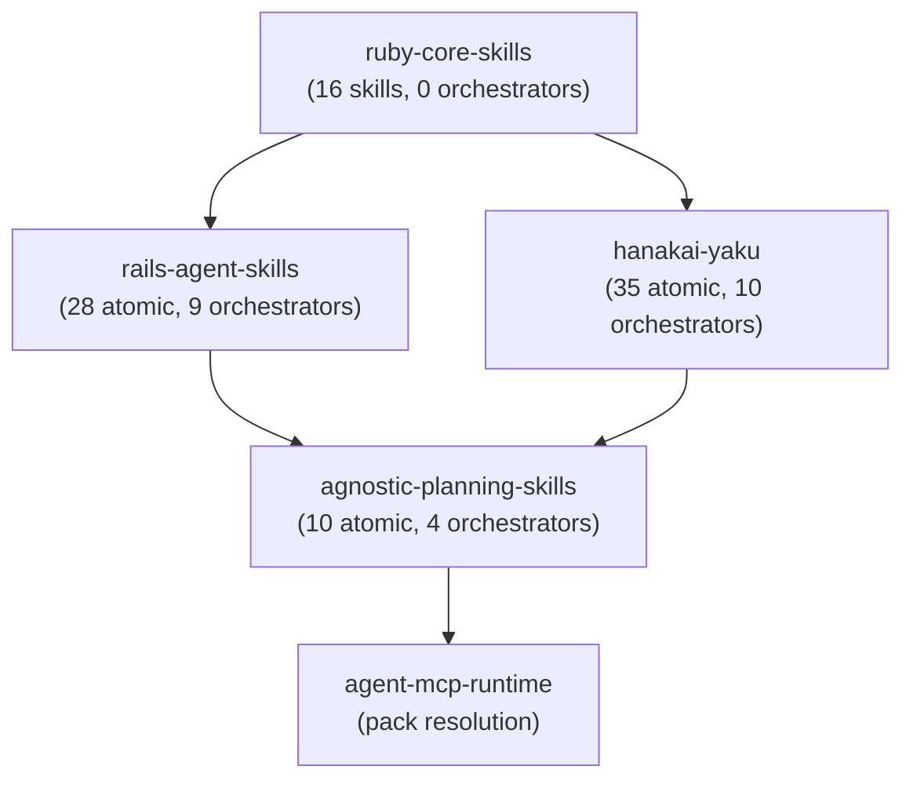

# Skill Classification Table

> **Status:** Final — Phase 0 Deliverable (Updated for Plan 4)
> **Date:** 2026-06-01
> **Scope:** All 112 skills across `rails-agent-skills`, `hanakai-yaku`, and `agnostic-planning-skills`
> **Target:** Post-migration state with `ruby-core-skills` as the shared foundation

---

## Executive Summary

This document maps every skill and orchestrator in the ecosystem to its target repository after the Phase 1–2 migration. The goal is to eliminate naming collisions, clarify ownership, and establish a clean dependency graph where `ruby-core-skills` provides shared atomic and process-discipline skills, and framework repos depend on it. Under Plan 4, all legacy "agents" are flattened into the skill catalog as orchestrators using the `verb-noun` naming convention.

**Pre-migration totals:**
- `rails-agent-skills`: 38 skills, 9 agents
- `hanakai-yaku`: 37 skills, 10 agents
- `agnostic-planning-skills`: 10 skills, 4 agents
- `ruby-core-skills`: 0 skills, 0 agents (empty)
- **Total: 85 skills, 23 agents**

**Post-migration totals (Plan 4 Unified Catalog):**
- `ruby-core-skills`: 16 atomic/process-discipline skills, 0 orchestrators
- `rails-agent-skills`: 37 skills (28 atomic, 9 orchestrators)
- `hanakai-yaku`: 45 skills (35 atomic, 10 orchestrators)
- `agnostic-planning-skills`: 14 skills (10 atomic, 4 orchestrators)
- **Total: 112 skills (89 atomic, 23 orchestrators)**

---

## Section 1 — Skills Moving to `ruby-core-skills`

### 1.1 Atomic Skills (extracted from `rails-agent-skills`)

These skills are framework-agnostic Ruby knowledge that should not live inside a Rails-specific repository.

| # | Skill | Current Path (rails) | Target Path (core) | Difficulty | Verification |
|---|-------|----------------------|--------------------|------------|------------|
| 1 | `write-yard-docs` | `skills/patterns/write-yard-docs/` | `skills/docs/write-yard-docs/` | Easy | No Rails references found |
| 2 | `create-service-object` | `skills/patterns/create-service-object/` | `skills/patterns/create-service-object/` | Easy | PORO `.call` pattern |
| 3 | `implement-calculator-pattern` | `skills/patterns/implement-calculator-pattern/` | `skills/patterns/implement-calculator-pattern/` | Easy | Pure Ruby strategy/factory |
| 4 | `integrate-api-client` | `skills/api/integrate-api-client/` | `skills/patterns/integrate-api-client/` | Easy | HTTP/Faraday layers |
| 5 | `define-domain-language` | `skills/ddd/define-domain-language/` | `skills/ddd/define-domain-language/` | Easy | DDD glossary process |
| 6 | `review-domain-boundaries` | `skills/ddd/review-domain-boundaries/` | `skills/ddd/review-domain-boundaries/` | Easy | Bounded context review |
| 7 | `model-domain` | `skills/ddd/model-domain/` | `skills/ddd/model-domain/` | Medium | De-Rails-ify examples |
| 8 | `triage-bug` | `skills/testing/triage-bug/` | `skills/testing/triage-bug/` | Medium | Generalize Rails-specific examples |
| 9 | `respond-to-review` | `skills/code-quality/respond-to-review/` | `skills/code-quality/respond-to-review/` | Easy | Framework-agnostic process |
| 10 | `skill-router` | `skills/orchestration/skill-router/` | `skills/orchestration/skill-router/` | Easy | Update routing table to core skills only |

### 1.2 Planning Skills (NEW)

| # | Skill | Target Path (core) | Purpose |
|---|-------|--------------------|---------|
| 11 | `generate-tdd-tasks` | `skills/planning/generate-tdd-tasks/` | Breaks features into TDD quadruplet task lists with auto-detected conventions, docs, and review tasks |

### 1.3 Process-Discipline Skills (NEW)

These encode universal process knowledge extracted from the common elements of framework-specific skills and orchestrators.

| # | Skill | Extracted From | Target Path (core) | Purpose |
|---|-------|----------------|--------------------|---------|
| 12 | `tdd-process` | Rails `write-tests` HARD-GATE + Hanami `tdd-loop` | `skills/process/tdd-process/` | Universal Red-Green-Refactor gates and checkpoints |
| 13 | `refactor-process` | Rails `refactor-code` + Hanami `refactor-code` | `skills/process/refactor-process/` | Characterization tests first, small steps, verify-after-each |
| 14 | `review-process` | Rails `code-review` + Hanami `review-code` | `skills/process/review-process/` | Severity levels, structured findings, re-review criteria |
| 15 | `security-review-process` | Rails `security-check` + Hanami `review-security` | `skills/process/security-review-process/` | OWASP checklist, Ruby-level security concerns |
| 16 | `test-planning-process` | Rails `plan-tests` + Hanami `plan-tests` | `skills/process/test-planning-process/` | Test-selection decision framework |

---

## Section 2 — Skills in `rails-agent-skills`

These 37 skills are Rails-specific and remain in `rails-agent-skills`. The 9 orchestrators (formerly agents) compose core processes and local atomic skills.

| # | Skill | Category | Path | Type | Core Reference |
|---|-------|----------|------|------|---------------|
| 1 | `generate-api-collection` | api | `skills/api/generate-api-collection/` | atomic | — |
| 2 | `implement-graphql` | api | `skills/api/implement-graphql/` | atomic | — |
| 3 | `apply-code-conventions` | code-quality | `skills/code-quality/apply-code-conventions/` | atomic | — |
| 4 | `apply-stack-conventions` | code-quality | `skills/code-quality/apply-stack-conventions/` | atomic | — |
| 5 | `code-review` | code-quality | `skills/code-quality/code-review/` | atomic | References `review-process` from core |
| 6 | `implement-authorization` | code-quality | `skills/code-quality/implement-authorization/` | atomic | — |
| 7 | `refactor-code` | code-quality | `skills/code-quality/refactor-code/` | atomic | References `refactor-process` from core |
| 8 | `review-architecture` | code-quality | `skills/code-quality/review-architecture/` | atomic | — |
| 9 | `security-check` | code-quality | `skills/code-quality/security-check/` | atomic | References `security-review-process` from core |
| 10 | `load-context` | context | `skills/context/load-context/` | atomic | — |
| 11 | `setup-environment` | context | `skills/context/setup-environment/` | atomic | — |
| 12 | `create-engine` | engines | `skills/engines/create-engine/` | atomic | — |
| 13 | `upgrade-engine` | engines | `skills/engines/upgrade-engine/` | atomic | — |
| 14 | `document-engine` | engines | `skills/engines/document-engine/` | atomic | — |
| 15 | `extract-engine` | engines | `skills/engines/extract-engine/` | atomic | — |
| 16 | `create-engine-installer` | engines | `skills/engines/create-engine-installer/` | atomic | — |
| 17 | `release-engine` | engines | `skills/engines/release-engine/` | atomic | — |
| 18 | `review-engine` | engines | `skills/engines/review-engine/` | atomic | — |
| 19 | `test-engine` | engines | `skills/engines/test-engine/` | atomic | — |
| 20 | `implement-background-job` | infrastructure | `skills/infrastructure/implement-background-job/` | atomic | — |
| 21 | `implement-hotwire` | infrastructure | `skills/infrastructure/implement-hotwire/` | atomic | — |
| 22 | `optimize-performance` | infrastructure | `skills/infrastructure/optimize-performance/` | atomic | — |
| 23 | `review-migration` | infrastructure | `skills/infrastructure/review-migration/` | atomic | — |
| 24 | `seed-database` | infrastructure | `skills/infrastructure/seed-database/` | atomic | — |
| 25 | `version-api` | infrastructure | `skills/infrastructure/version-api/` | atomic | — |
| 26 | `plan-tests` | testing | `skills/testing/plan-tests/` | atomic | References `test-planning-process` from core |
| 27 | `write-tests` | testing | `skills/testing/write-tests/` | atomic | References `tdd-process` from core |
| 28 | `test-service` | testing | `skills/testing/test-service/` | atomic | — |
| 29 | `practice-tdd` | testing | `skills/testing/practice-tdd/` | orchestrator | `tdd-process`, `write-yard-docs` |
| 30 | `review-code` | code-quality | `skills/code-quality/review-code/` | orchestrator | `review-process` |
| 31 | `initialize-environment` | context | `skills/context/initialize-environment/` | orchestrator | — |
| 32 | `improve-code-quality` | code-quality | `skills/code-quality/improve-code-quality/` | orchestrator | `refactor-process`, `review-process` |
| 33 | `integrate-engine` | engines | `skills/engines/integrate-engine/` | orchestrator | — |
| 34 | `resolve-bug` | testing | `skills/testing/resolve-bug/` | orchestrator | `triage-bug` |
| 35 | `integrate-graphql-api` | api | `skills/api/integrate-graphql-api/` | orchestrator | `tdd-process`, `write-yard-docs` |
| 36 | `apply-migration` | infrastructure | `skills/infrastructure/apply-migration/` | orchestrator | — |
| 37 | `schedule-background-job` | infrastructure | `skills/infrastructure/schedule-background-job/` | orchestrator | `tdd-process`, `write-yard-docs` |

---

## Section 3 — Skills in `hanakai-yaku`

These 45 skills are Hanami/dry-rb/ROM-specific and remain in `hanakai-yaku`.

| # | Skill | Category | Path | Type | Core Reference |
|---|-------|----------|------|------|---------------|
| 1-35 | *(Atomic catalog)* | various | `skills/` | atomic | List unchanged (35 skills) |
| 36 | `practice-tdd` | testing | `skills/testing/practice-tdd/` | orchestrator | `tdd-process`, `test-planning-process` |
| 37 | `schedule-background-job` | infrastructure | `skills/infrastructure/schedule-background-job/` | orchestrator | `tdd-process` |
| 38 | `add-table-column` | db | `skills/db/add-table-column/` | orchestrator | `tdd-process` |
| 39 | `build-api-slice` | slices | `skills/slices/build-api-slice/` | orchestrator | `tdd-process`, `write-yard-docs` |
| 40 | `build-crud-resource` | slices | `skills/slices/build-crud-resource/` | orchestrator | `tdd-process`, `write-yard-docs` |
| 41 | `create-new-slice` | slices | `skills/slices/create-new-slice/` | orchestrator | `tdd-process` |
| 42 | `setup-hanami` | cli | `skills/cli/setup-hanami/` | orchestrator | — |
| 43 | `configure-authentication` | cross-cutting | `skills/cross-cutting/configure-authentication/` | orchestrator | `tdd-process` |
| 44 | `manage-slice-lifecycle` | slices | `skills/slices/manage-slice-lifecycle/` | orchestrator | `refactor-process`, `review-process` |
| 45 | `validate-data` | dry-rb | `skills/dry-rb/validate-data/` | orchestrator | `tdd-process` |

---

## Section 4 — Skills in `agnostic-planning-skills`

These 14 skills remain in `agnostic-planning-skills`.

| # | Skill | Category | Path | Type |
|---|-------|----------|------|------|
| 1-10 | *(Atomic catalog)* | various | `skills/` | atomic | List unchanged (10 skills) |
| 11 | `orchestrate-delivery` | ceremony | `skills/ceremony/orchestrate-delivery/` | orchestrator |
| 12 | `manage-product-backlog` | backlog | `skills/backlog/manage-product-backlog/` | orchestrator |
| 13 | `manage-project` | execution | `skills/execution/manage-project/` | orchestrator |
| 14 | `guide-technical-design` | execution | `skills/execution/guide-technical-design/` | orchestrator |

---

## Section 5 — Post-Migration Summary

### 5.1 Repository Inventory

| Repository | Atomic/Process Skills | Orchestrator Workflows | `depends_on` |
| ----------------------------| -----------------------| -----------------------| --------------------|
| `ruby-core-skills` | 16 | 0 | `agnostic-planning-skills` |
| `rails-agent-skills` | 28 | 9 | `ruby-core-skills` |
| `hanakai-yaku` | 35 | 10 | `ruby-core-skills` |
| `agnostic-planning-skills` | 10 | 4 | — |
| **Total** | **89** | **23** | |

### 5.2 Dependency Graph

```mermaid
flowchart TB
    core["ruby-core-skills<br/>(16 skills, 0 orchestrators)"]
    rails["rails-agent-skills<br/>(28 atomic, 9 orchestrators)"]
    hanakai["hanakai-yaku<br/>(35 atomic, 10 orchestrators)"]
    agnostic["agnostic-planning-skills<br/>(10 atomic, 4 orchestrators)"]
    runtime["agent-mcp-runtime<br/>(pack resolution)"]

    core --> rails
    core --> hanakai
    rails --> agnostic
    hanakai --> agnostic
    agnostic --> runtime
```

---

## Appendix A — Verification Checklist

- [ ] `rails-agent-skills` `.tessl-plugin/plugin.json` / `directory.json` contains exactly the 37 skills listed in Section 2 (under `"skills"`)
- [ ] `hanakai-yaku` `.tessl-plugin/plugin.json` / `directory.json` contains exactly the 45 skills listed in Section 3 (under `"skills"`)
- [ ] `agnostic-planning-skills` `.tessl-plugin/plugin.json` / `directory.json` contains exactly the 14 skills listed in Section 4 (under `"skills"`)
- [ ] `ruby-core-skills` `.tessl-plugin/plugin.json` / `directory.json` contains exactly the 16 skills listed in Section 1 (under `"skills"`)
